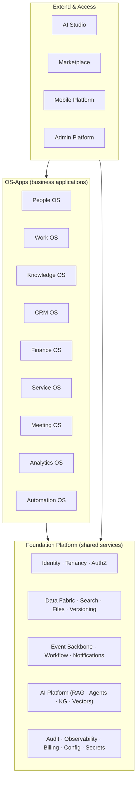

# 03 · Enterprise OS Overview

## 3.1 The ecosystem at a glance

Calyvora is one platform with three layers. Everything above the line is a business
application; everything below is the shared substrate those applications run on.

**The core thesis, restated architecturally:** each OS-app is independently valuable and
independently deployable, but *none* reimplements identity, permissions, search, files,
events, audit, or AI. They all consume the Foundation. That is what makes them integrated by
construction rather than by integration project.

## 3.2 How to read each app entry

For every application we state: **Purpose** (what it does), **Target users** (who lives in
it), **Business value** (why a customer pays), **Dependencies** (what it needs from the
Foundation and other apps), and **Future expansion** (where it grows). Deep module-level
detail lives in [04 · Product Map](04-product-map.md); this document is the tour.

---

## 3.3 People OS

- **Purpose:** The system of record for humans in the organization and their entire
  lifecycle — hire to retire. Core HRIS, recruiting/ATS, onboarding, time & attendance,
  leave, performance, goals, and org structure.
- **Target users:** Every employee (self-service), managers, HR, recruiters, IT admins.
- **Business value:** Replaces Keka / BambooHR / Workday HCM / SuccessFactors and an ATS
  like Greenhouse. Because it owns the org tree and employee records, it becomes the
  **identity and permission backbone** every other app relies on — this is why it's usually
  the beachhead app.
- **Dependencies:** Identity & Tenancy (users originate here), Workflow (approvals,
  onboarding), Documents (offer letters, policies), AI Platform (screening, drafting).
  It is the *producer* of the org graph that CRM, Work, Finance, and Analytics consume.
- **Future expansion:** Payroll (deep integration with Finance OS), benefits administration,
  compensation planning, learning management, workforce planning, contingent workforce.

## 3.4 Work OS

- **Purpose:** Plan, track, and execute work — projects, tasks, sprints, roadmaps, OKRs,
  issues, and portfolios. The connective tissue between "what the company wants to do" and
  "what people are doing."
- **Target users:** Engineering, product, design, marketing, operations — anyone who runs
  projects. Managers and executives for portfolio/roadmap views.
- **Business value:** Replaces Jira / Azure DevOps / ClickUp / Monday / Asana. Its edge:
  work items are linked natively to the *people* (People OS), *documents* (Knowledge OS),
  *customers* (CRM OS), and *tickets* (Service OS) they relate to — no integration required.
- **Dependencies:** Identity, Org graph (People OS), Notifications, Search, Workflow,
  Documents, AI Platform (planning, standup summaries, triage). Often deployed alongside
  Knowledge OS as the "Work Suite."
- **Future expansion:** Agile/Dev-specific tooling (source-control and CI/CD integration,
  release management), resource/capacity planning, professional-services automation (PSA),
  goal/OKR alignment across the org.

## 3.5 Knowledge OS

- **Purpose:** The organization's memory — documents, wikis, pages, notes, and structured
  knowledge. A collaborative editor plus a knowledge base plus the substrate for the AI
  knowledge graph.
- **Target users:** Everyone. Especially product, engineering, HR, support, and any
  knowledge worker who writes or reads docs.
- **Business value:** Replaces Notion / Confluence / SharePoint-as-wiki. Its edge: knowledge
  is *linked* to the work, people, and customers it describes, and it's the richest fuel for
  RAG — making the org's AI dramatically smarter than a chatbot over a single doc store.
- **Dependencies:** Documents & Versioning, Files, Search, Comments, Identity, AI Platform
  (semantic search, summarization, Q&A over the corpus).
- **Future expansion:** Structured databases/tables (Notion-style), internal knowledge
  agents, automated documentation from events, whiteboards, forms.

## 3.6 CRM OS

- **Purpose:** Manage the full customer relationship — leads, contacts, accounts,
  opportunities, pipeline, and marketing. The revenue-facing counterpart to People OS.
- **Target users:** Sales, marketing, customer success, revenue operations, executives.
- **Business value:** Replaces HubSpot / Salesforce / Zoho. Its edge: the customer record is
  natively connected to the *work* delivered for them (Work OS), the *support* they receive
  (Service OS), the *invoices* they're sent (Finance OS), and the *documents* shared with
  them (Knowledge OS) — a true 360° view without a data-integration project.
- **Dependencies:** Identity, Org graph, Documents (quotes, contracts), Workflow (approvals),
  Notifications, AI Platform (lead scoring, next-best-action, email drafting), Meeting OS
  (call notes), Analytics OS (pipeline dashboards).
- **Future expansion:** Marketing automation, CPQ (configure-price-quote), customer success
  health scoring, partner relationship management, revenue intelligence.

## 3.7 Finance OS

- **Purpose:** The financial backbone — invoicing, billing, expenses, procurement,
  budgeting, and the general ledger. Turns operational activity into financial truth.
- **Target users:** Finance, accounting, procurement, managers (approvals/budgets), and
  every employee (expenses).
- **Business value:** Replaces the finance modules of SAP/Oracle/Zoho Books/QuickBooks and
  expense tools like Expensify. Its edge: financial events flow *automatically* from the
  operational apps — a closed deal in CRM proposes an invoice; an approved hire in People OS
  updates headcount cost; project time in Work OS drives client billing.
- **Dependencies:** Identity, Org graph, Workflow (approvals are central here), Documents
  (invoices, POs), Audit (financial audit is non-negotiable), AI Platform (anomaly
  detection, forecasting, invoice extraction), and events from CRM/People/Work.
- **Future expansion:** Full double-entry accounting/GL, payroll (with People OS), revenue
  recognition, multi-currency/multi-entity consolidation, tax, treasury.

> **Note on regulatory weight:** Finance OS carries the heaviest correctness, audit, and
> compliance requirements. It is deliberately scheduled *later* (Phase 3) so it's built on a
> mature Foundation, not on shifting ground. See [11 · Roadmap](11-roadmap.md).

## 3.8 Service OS

- **Purpose:** Service and support management — ticketing, help desk, IT service management
  (ITSM), incident management, and internal service catalogs. Both customer-facing support
  and internal IT/HR/facilities service.
- **Target users:** Support agents, IT admins, employees (as requesters), and any team that
  receives and resolves requests (HR helpdesk, facilities, legal).
- **Business value:** Replaces Freshservice / ServiceNow / Zendesk. Its edge: internal
  service requests are natively linked to the employee (People OS), their assets, and the
  workflows that fulfill them; customer support tickets are linked to the CRM account.
- **Dependencies:** Identity, Org graph, Workflow (fulfillment), Knowledge OS (KB articles,
  deflection), Notifications, AI Platform (auto-triage, agent assist, deflection bots),
  CRM OS (customer context), Automation OS (fulfillment automation).
- **Future expansion:** Asset & configuration management (CMDB), change/problem management,
  SLAs and escalation, employee experience/service portal, field service.

## 3.9 Meeting OS

- **Purpose:** Meetings and real-time collaboration — scheduling, video/audio meetings,
  team chat/channels, and the capture of meeting outcomes (transcripts, summaries, action
  items). The synchronous complement to the asynchronous apps.
- **Target users:** Everyone. Especially teams that live in chat and meetings today.
- **Business value:** Replaces Slack / Microsoft Teams / Zoom for the *collaboration and
  meeting-capture* layer. Its edge: a meeting isn't a dead-end recording — its transcript
  feeds the knowledge graph, its action items become Work OS tasks, its notes attach to the
  CRM deal or Service ticket that prompted it.
- **Dependencies:** Identity, Calendar, Messaging, Notifications, Files (recordings),
  AI Platform (transcription, summarization, action-item extraction), Work OS (tasks),
  Knowledge OS (notes), Search.
- **Future expansion:** Real-time co-editing surfaces, whiteboarding, voice agents that
  attend meetings, deeper telephony/contact-center features.

> *Build-vs-partner note:* real-time video infrastructure is a specialized, capital-intensive
> domain. Phase 1–2 Meeting OS focuses on **chat, scheduling, and meeting-capture**, likely
> integrating a best-in-class video provider before building native video. This is an
> explicit trade-off, revisited by ADR.

## 3.10 Analytics OS

- **Purpose:** Cross-application business intelligence — dashboards, reports, metrics, and
  data exploration over the entire platform's data. The place where the *connectedness* of
  everything pays off most visibly.
- **Target users:** Executives, analysts, RevOps/PeopleOps/FinOps, managers, and (via
  embedded analytics) every user seeing metrics in-context inside other apps.
- **Business value:** Replaces Power BI / Tableau / Looker *for data that already lives in
  Calyvora*. Its edge: no ETL, no data warehouse integration project — because the data is
  already unified in one platform with one permission model, cross-domain analytics
  ("revenue per employee by department, trended against hiring") is a native, governed query.
- **Dependencies:** Analytics data platform (event-sourced projections + a warehouse layer),
  Identity & AuthZ (row/column-level security must apply to analytics too), every OS-app as a
  data producer, AI Platform (natural-language querying, auto-insights).
- **Future expansion:** Embedded analytics SDK for other apps and the Marketplace, predictive
  analytics, data-app builder, external data connectors, a governed semantic layer.

## 3.11 Automation OS

- **Purpose:** No-code/low-code automation and orchestration across every app — triggers,
  conditions, actions, and multi-step workflows that span domains. "When X happens in app A,
  do Y in app B."
- **Target users:** Business/ops power users, admins, and developers building custom logic;
  indirectly every user who benefits from automated processes.
- **Business value:** Replaces Zapier / Power Automate / Workato *for intra-Calyvora
  automation* and connects out to external systems. Its edge: because it sits on the native
  event backbone with the native permission model, cross-app automation is reliable,
  governed, and instantaneous — not brittle polling through third-party connectors.
- **Dependencies:** Event Backbone (its trigger source), Workflow engine, Identity & AuthZ
  (automations run as scoped principals), every app's registered actions/triggers, AI
  Platform (AI steps: classify, extract, draft, decide), Integration Platform (external systems).
- **Future expansion:** AI-authored automations ("describe the process, we build the flow"),
  agentic workflows (an agent as a workflow step), process mining from events, an automation
  template marketplace.

## 3.12 The Extend & Access layer

- **AI Studio** — where customers and partners *build* with AI: custom agents, prompts,
  knowledge bases, and AI-powered app logic on top of the shared AI Platform. See
  [09 · AI Strategy](09-ai-strategy.md).
- **Marketplace** — the ecosystem storefront: third-party apps, extensions, automation
  templates, and AI agents, installable into a tenant with governed permissions.
- **Mobile Platform** — the cross-platform mobile foundation (not a separate product but the
  mobile face of every OS-app), with offline support and push.
- **Admin Platform** — the single control plane for tenant admins: users, org, roles,
  billing, security, integrations, audit, and app configuration across every app.

Detailed missions, modules, and AI opportunities for all of the above are in
[04 · Complete Product Map](04-product-map.md).

## 3.13 Why this decomposition (and not another)

We drew app boundaries along **organizational functions with distinct primary users and
distinct systems of record**, because that:

1. **Matches how customers buy and adopt** (they think "we need HR" or "we need a CRM"),
   enabling clean land-and-expand and clean packaging.
2. **Gives each app a clear System of Record** (People owns employees, CRM owns customers,
   Finance owns money), avoiding the "who owns this data" fights that plague suites.
3. **Aligns to team ownership** — one app ≈ one product/engineering group, reducing
   coordination cost (Conway's Law working *for* us).

We deliberately did **not** decompose by technical layer (a "notifications app," a "search
app") — those are *shared services*, not products, and live in the Foundation ([05](05-shared-platform-services.md)).
Nor did we build one monolithic "do-everything" app, which would collapse ownership and UX.
