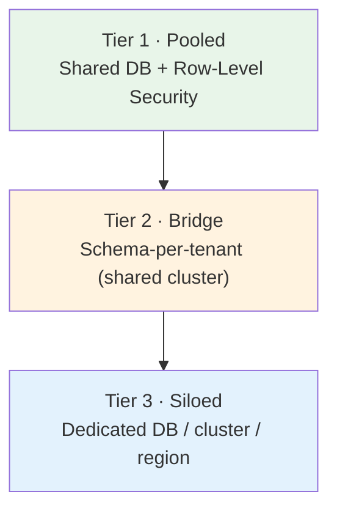

# 07 · Multi-Tenant Strategy

Multi-tenancy is the single most consequential architectural decision for a SaaS platform of
this scope. Get it wrong and you get data breaches, "noisy neighbor" outages, an inability to
serve regulated customers, and a rewrite. This document defines how we isolate, scale, back
up, and regionalize tenants — and why.

## 7.1 First principle: tenant context is ambient and mandatory

Every request carries an authenticated **tenant context**, injected by the platform (from the
authenticated principal), **not** passed by application code. `tenant_id` is present in every
row, every event, every cache key, every log line, every vector, every object-storage path,
and every search document. There is no code path that operates without a tenant. This is the
foundation everything else rests on. See [02 · Multi-Tenant](02-product-philosophy.md#28-multi-tenant).

## 7.2 The isolation tiers (hybrid model)

We do **not** pick one isolation model — different customers have different risk, scale, and
compliance profiles. We offer a **tiered, hybrid model** and place tenants on the tier their
plan and requirements demand.

| Tier | Model | Isolation | Cost/tenant | Who gets it | Trade-offs |
|------|-------|-----------|-------------|-------------|------------|
| **1 · Pooled** | Shared database, shared schema, **Postgres Row-Level Security (RLS)** keyed on `tenant_id` | Logical | Lowest | SMB & most mid-market (the majority) | Best economics & operability; noisy-neighbor and blast-radius risk mitigated by quotas + RLS. The default. |
| **2 · Bridge** | Shared cluster, **schema (or database) per tenant** | Stronger logical | Medium | Larger mid-market, tenants with per-tenant customization or data-volume needs | Stronger isolation and per-tenant backup/restore; higher connection/migration overhead. |
| **3 · Siloed** | **Dedicated database / cluster**, optionally dedicated region or customer cluster | Physical | Highest | Enterprise, regulated (finance/health/gov), data-residency mandates | Maximum isolation & residency control; highest cost & ops complexity; premium pricing justifies it. |

**Why hybrid rather than one model:**

- *Pure pooled (shared everything)* has the best unit economics but can't satisfy enterprises
  who contractually require physical isolation or in-region data — losing the most lucrative
  segment.
- *Pure siloed (DB per tenant)* gives great isolation but destroys margins at SMB scale and
  makes fleet operations (migrations across 100k tenants) a nightmare.
- **Hybrid** lets us win the whole market: cheap and dense at the bottom, isolated and
  compliant at the top — *on the same codebase*, because the application code is
  tenant-agnostic and only the data-routing layer differs per tier.

**Critical enabler:** application code must be written **identically** across tiers. A
**Tenant Router / data-access layer** resolves, per request, which physical database/schema
serves this tenant. Apps never hardcode a tier. This is what makes promoting a tenant from
Tier 1 → Tier 3 an operational migration, not a code change.

## 7.3 Defense in depth for isolation

Isolation is never trusted to a single mechanism:

1. **Ambient tenant context** enforced at the framework level (no manual `tenant_id` passing).
2. **Row-Level Security** in Postgres as a backstop — even a query that "forgets" the tenant
   predicate returns nothing, because the DB policy filters by the session's tenant.
3. **A lint/analysis rule** failing any query without a tenant scope in code review.
4. **Automated isolation tests** in CI that authenticate as tenant A and attempt to read
   tenant B's data across every API — and must fail to retrieve anything.
5. **Tenant-scoped everything downstream**: cache keys, search filters, object paths, vector
   namespaces, event routing, and logs.
6. **Per-tenant encryption keys** (Tier 3, and optionally Tier 2) so even at rest the blast
   radius of a key compromise is one tenant. See [08](08-security-architecture.md).

## 7.4 Noisy-neighbor & fairness

In pooled tiers, one tenant must not degrade others:

- **Per-tenant rate limits and quotas** at the gateway and in expensive services (search, AI,
  exports, reporting).
- **Resource fairness** — heavy async work (bulk imports, large reports, AI batch jobs) runs
  on separate worker pools with per-tenant concurrency caps, not on the request path.
- **Usage metering** feeds Billing and surfaces abusive patterns for auto-throttling or tier
  promotion.
- **Connection management** — pooled DB access via a proxy (e.g., PgBouncer) to prevent
  connection exhaustion.

## 7.5 Scaling strategy

- **Horizontal, stateless services** scale on load (HPA). Statelessness is what makes this
  trivial.
- **Data-layer scaling:** read replicas for read-heavy paths; **shard the pooled tiers by
  tenant** as they grow (tenants are a natural, clean shard key — a tenant's data never spans
  shards). This "cell-based" / shard-per-tenant-group architecture caps blast radius: a
  failing shard affects one group of tenants, not everyone.
- **Cell-based architecture (long-term):** group tenants into independently-deployed **cells**
  (a full stack serving a subset of tenants). Cells give bounded blast radius, easier
  capacity planning, and a clean unit for regional and enterprise-dedicated deployment. This
  is the end-state that reconciles "millions of tenants" with "one small tenant's incident
  can't take down the platform."

## 7.6 Backups & disaster recovery

- **Continuous backups** (point-in-time recovery) for all transactional data; encrypted;
  cross-region copies for DR.
- **Per-tenant restore:** Tier 2/3 support restoring a *single* tenant to a point in time
  (essential for "we deleted the wrong thing" and for compliance). Pooled Tier 1 supports
  logical per-tenant export/restore via tenant-scoped operations.
- **Defined RPO/RTO per tier**, tightening as isolation increases (enterprise contracts set
  these as SLAs).
- **Regular restore drills** — an untested backup is not a backup. DR failover is exercised
  on a schedule, not assumed.
- **Object storage & search/vector indexes** are reproducible from the SoR + event log
  (rebuildable read models), so backup focus is the Postgres SoR and the event log.

## 7.7 Regional & data-residency deployments

- **Region as a deployment unit.** The platform deploys as a full stack per region. A
  tenant is *homed* to a region; its data (SoR, files, search, vectors, backups) lives there.
- **Data residency** (EU, US, India, etc.) is satisfied by homing the tenant's cell in the
  required region — a first-class selling point for the enterprise/regulated segment and a
  hard requirement in many geographies (GDPR, data-localization laws).
- **Global vs regional data:** tenant business data is regional; only minimal global routing
  metadata (which region hosts tenant X) is replicated globally. We keep the global surface
  tiny to keep residency guarantees clean.
- **Multi-region within a tenant** (for large enterprises operating globally) is a Tier-3
  capability handled per contract.

## 7.8 Enterprise & regulated customers (Tier 3 specifics)

- **Dedicated isolation:** own database/cluster, own encryption keys (with **BYOK / customer-
  managed keys** option), own region.
- **Customer-cluster / private-cloud deployment:** because we're cloud-agnostic on
  Kubernetes, we can deploy a cell into a customer's own environment for the most stringent
  cases — a door closed to competitors built on one cloud's proprietary stack.
- **Compliance posture:** dedicated audit exports, access reviews, DLP, longer retention, and
  contractual RPO/RTO/SLA. See [08](08-security-architecture.md) and [13](13-risk-analysis.md).
- **Onboarding/migration tooling:** promoting a tenant across tiers is a supported, automated
  operation (export → provision isolated infra → import → cut over), not a bespoke project.

## 7.9 Summary: why this strategy wins

It lets one codebase profitably serve a 20-person startup and a 50,000-person regulated bank,
because **isolation is a data-routing and infrastructure concern, not an application concern.**
Application engineers write tenant-agnostic code once; the platform decides how strongly to
isolate each tenant based on their tier. That separation is the whole game — it's what makes
"start cheap, grow into enterprise-grade" possible without forks or rewrites.
