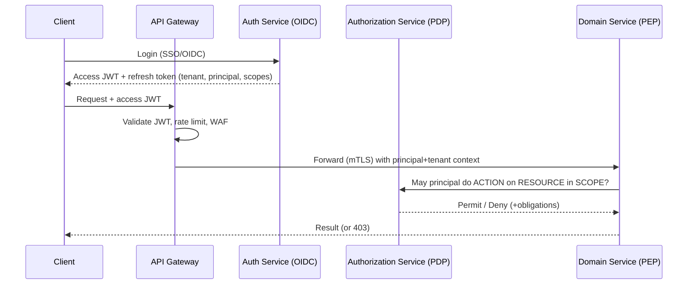

# 08 · Security Architecture

We hold the entire operational data of our customers. Security is not a feature; it is the
precondition for the company existing. This document defines how we authenticate, authorize,
encrypt, audit, and comply — and why each choice was made. Governing principles:
[Security First](02-product-philosophy.md#29-security-first) and
[Zero Trust](02-product-philosophy.md#210-zero-trust).

## 8.1 Authentication (AuthN)

**Decision:** Standards-based **OAuth 2.0 / OpenID Connect (OIDC)**. Calyvora acts as an OIDC
**Relying Party** federating to customer IdPs, and as an OAuth Authorization Server issuing
tokens to our own clients and to Marketplace apps.

- **SSO:** first-class federation to **Microsoft Entra ID, Google Workspace, and Okta**
  (plus generic SAML 2.0 / OIDC for anything else). Enterprises will not adopt a platform
  that doesn't slot into their existing identity — SSO is table stakes.
- **SCIM 2.0** for automated user provisioning/deprovisioning from the customer's IdP —
  critical so that offboarding an employee there instantly cuts access here.
- **MFA / passkeys:** support (and let admins enforce) MFA and WebAuthn/passkeys for direct
  logins.
- **Sessions & tokens:** short-lived **JWT access tokens** (minutes) + **rotating refresh
  tokens** (with reuse detection → revoke the family on replay). Access tokens are validated
  at the gateway and by services; they carry principal, tenant, and scope claims — but
  *not* fine-grained permissions (those are evaluated live; see §8.3).

**Why OIDC/OAuth (not homegrown):** these are battle-tested standards with vast tooling and
auditor familiarity. Rolling our own auth is the single most common catastrophic security
mistake. We use proven libraries and, where sensible, a hardened identity provider component.

**Why short access + rotating refresh tokens:** short access tokens limit the window a stolen
token is useful; rotating refresh tokens with reuse detection turn token theft into a
detectable, self-revoking event rather than a silent, permanent compromise.

## 8.2 The AuthN/AuthZ separation

Authentication proves identity; **authorization is decided separately and live**, on every
sensitive action, by a central Policy Decision Point (PDP). Services are Policy Enforcement
Points (PEPs). This separation means we can change *what someone can do* without reissuing
tokens, and it gives us one consistent, auditable decision surface for humans **and AI
agents**.

## 8.3 Authorization (AuthZ): RBAC + ABAC hybrid

**Decision:** A **hybrid RBAC + ABAC** model, evaluated by a central Authorization Service,
with **policy-as-data** so permissions are auditable, testable, and changeable without deploys.

- **RBAC** for the common case: users get **roles** (e.g., *HR Admin*, *Sales Rep*, *Project
  Lead*) that bundle permissions. Simple to reason about and administer.
- **ABAC** for the nuance RBAC can't express: rules over attributes of the **principal,
  resource, action, and context** — e.g., "a manager may view compensation *only for their
  own reports*," "finance approvers may approve invoices *under their limit*," "documents
  tagged *confidential* are visible only to their workspace and during business hours."
- **Scopes** bound every permission to a tenant, org node, workspace, or specific resource,
  so authority is naturally hierarchical (org-tree-aware).

**Why hybrid (not one or the other):** pure RBAC leads to **role explosion** (a new role for
every combination of conditions) and can't express relationship- or context-dependent rules.
Pure ABAC is powerful but hard for admins to reason about and audit. Hybrid gives admins
simple roles for 90% of cases and precise attribute policies for the hard 10% — the model
used by every mature enterprise platform (and, notably, the only model that makes *AI agent*
permissions tractable, since an agent's authority must be finely scoped and contextual).

**Relationship-based access (ReBAC)** patterns (e.g., "who can access this document via
sharing/hierarchy") are supported via the graph of grants — important for collaboration
features and modeled explicitly rather than bolted on.

Authorization decisions are **cached carefully** (tenant-scoped, short TTL, invalidated on
role/policy change) to stay fast without going stale on revocation.

## 8.4 Encryption

- **In transit:** TLS 1.2+ externally; **mTLS between all internal services** (service mesh).
  No plaintext on any hop.
- **At rest:** transparent encryption for databases, object storage, search, backups, and
  vectors. **Envelope encryption** with a KMS; **per-tenant data keys** so a single key
  compromise is contained to one tenant.
- **BYOK / customer-managed keys** for Tier-3/enterprise tenants — they can bring and revoke
  their own keys (crypto-shredding), a hard requirement for many regulated buyers.
- **Field-level encryption** for the most sensitive fields (SSNs, bank details, secrets)
  beyond the default at-rest layer.
- **Secrets** never live in code, images, or config: a dedicated **Secrets service / vault**
  stores and rotates them, delivered to workloads via short-lived, audited leases.

## 8.5 Audit logging

**Decision:** A dedicated, **append-only, tamper-evident Audit service** records *who did
what, when, to what, from where, and (where relevant) why* — across every app **and every AI
agent action**.

- **Immutable & tamper-evident:** append-only storage with integrity chaining (hash-linked
  entries) so tampering is detectable.
- **Comprehensive:** authentication events, permission changes, data access to sensitive
  records, configuration changes, exports, admin actions, and **all AI agent
  tool-invocations** (see [09](09-ai-strategy.md#98-ai-governance-permissions--audit)).
- **Queryable & exportable:** admins explore audit in the Admin Platform; enterprises get
  streaming export to their SIEM.
- **Distinct from operational logging:** Audit is business/security truth with long retention
  and strict integrity; Logging is diagnostic and shorter-lived. Conflating them is a
  compliance failure.

**Why:** audit is the backbone of trust, incident forensics, and every major compliance
regime. In an AI-native platform it's doubly essential — you must be able to prove exactly
what an autonomous agent did on the customer's behalf.

## 8.6 Zero Trust & service identity

- **No implicit network trust.** Every request — external, internal, and agent-initiated —
  is authenticated and authorized. "Inside the mesh" grants nothing by itself.
- **Workload identity:** every service has a cryptographic identity (mesh-issued
  certificates, SPIFFE-style); service-to-service calls use mTLS and are authorized like
  users.
- **Least privilege everywhere:** services, jobs, and agents get the minimum scopes needed;
  credentials are short-lived; standing access is minimized.
- **Segmentation:** network policies restrict which services may talk to which; the data tier
  is reachable only by its owning services.

## 8.7 API & edge security

- **Gateway-enforced:** authentication, per-tenant and per-principal **rate limiting**,
  quota enforcement, **WAF**, bot/abuse protection, and payload validation against schemas.
- **Input validation & output encoding** everywhere to defeat injection/XSS; parameterized
  queries only (no string-built SQL); strict CORS.
- **Marketplace/extension safety:** third-party code runs **sandboxed** with explicitly
  granted, revocable scopes and its own rate limits; it can never exceed the installing
  tenant's permissions. Extension submissions pass an automated security review pipeline.
- **DDoS protection** at the edge/CDN layer.

## 8.8 Vulnerability & supply-chain management

- **SAST, DAST, dependency (SCA), secret-scanning, and license scanning** run in CI; builds
  fail on high-severity findings.
- **SBOM** generated per build; signed artifacts; verified provenance in the deploy pipeline
  (defends against supply-chain compromise — a named risk in [13](13-risk-analysis.md)).
- **Patch SLA** by severity; **regular third-party penetration tests**; a **bug-bounty**
  program once externally exposed.
- **Least-privilege CI/CD:** the pipeline itself is a high-value target and is locked down
  (scoped credentials, no long-lived cloud keys, protected environments).

## 8.9 Compliance

Compliance is designed for from day one (retrofitting it is enormously expensive), sequenced
to the customer segments we pursue:

| Framework | Why / when |
|-----------|------------|
| **SOC 2 Type II** | The baseline B2B SaaS trust bar; pursue early (Phase 2). |
| **GDPR / data-protection** | Required to serve EU and, structurally, good global hygiene: data residency (§[07](07-multi-tenant-strategy.md#77-regional--data-residency-deployments)), DSAR/erasure tooling, DPAs, data-processing records. Built into the data model (data classification, retention, right-to-erasure) from the start. |
| **ISO 27001** | Enterprise procurement expectation; Phase 3. |
| **HIPAA / PCI / FedRAMP / SOC for specific verticals** | Only as we pursue those verticals; Tier-3 isolation and BYOK make them attainable. |
| **AI-specific (e.g., EU AI Act) governance** | AI transparency, human oversight, and audit — see [09](09-ai-strategy.md). Emerging but coming fast; our AI-audit-by-default posture positions us well. |

Data-lifecycle features that make compliance real: **data classification labels** driving
encryption/retention/residency automatically; **configurable retention & deletion**;
**right-to-erasure** and **data-portability/export** as first-class, tenant-scoped operations.

## 8.10 Operational security & incident response

- **Documented incident response plan** with severity levels, on-call, and communication
  templates; **regular drills** (security incidents and DR both).
- **Detection:** anomaly detection on access patterns, alerting on privilege escalation and
  unusual data egress, SIEM integration.
- **Breach containment** by design: tenant isolation, per-tenant keys, and cell architecture
  bound blast radius so one incident is not a total compromise.
- **Human factor:** least-privilege internal access to production (just-in-time, audited,
  approved), mandatory security training, and phishing-resistant MFA for staff.

**The through-line:** security here is *structural* — the multi-tenant, Zero-Trust,
per-tenant-key, centrally-authorized, fully-audited design means the secure path is the
default path, and the blast radius of any single failure is deliberately small.
