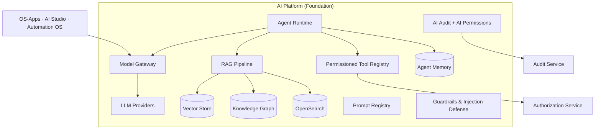

# 09 · AI Strategy

Calyvora is **AI-native**, not AI-adjacent. The difference is architectural: AI is a
Foundation service every app consumes, with first-class access to the organization's data
(under the same permissions as humans) and the ability to *act* through the same APIs. This
is what lets us ship cross-domain intelligence no single-silo competitor can. Principle:
[AI First](02-product-philosophy.md#22-ai-first-ai-native).

## 9.1 Why a shared AI Platform (not AI-per-app)

If each app built its own AI, we'd get: duplicated model plumbing, inconsistent guardrails,
siloed knowledge (an assistant that can't see across domains), fragmented governance, and no
single place to audit AI actions. Instead, **one AI Platform** in the Foundation provides
model access, retrieval, agents, memory, and governance to every app. The org's *connected*
data is the moat; a shared AI layer is what turns that moat into leverage.

## 9.2 Model Gateway — the single AI egress

**Decision:** All LLM/model calls go through one **Model Gateway**. Nothing calls a provider
directly.

**Responsibilities:** provider abstraction and routing, model selection per task/cost/latency,
prompt-injection and output guardrails, PII handling, per-tenant rate/cost limits, caching,
retries/fallback, and **AI audit** of every call. **Why:** one enforcement point for
security, cost, governance, and provider independence.

**Provider strategy:** **model-provider-abstracted**, defaulting to the latest, most capable
**Claude** models (Opus/Sonnet/Haiku tiers routed by task) via the gateway, with the ability
to route to alternates or **customer-hosted/BYO models** (enterprise/regulated). We avoid
hard lock-in to any single model vendor the same way we avoid cloud lock-in — the gateway is
the abstraction seam. Smaller/cheaper models handle high-volume classify/extract tasks; the
strongest models handle reasoning/agentic work.

## 9.3 Retrieval-Augmented Generation (RAG)

**Decision:** Grounding-first. The model answers from **retrieved, permission-filtered tenant
data**, not from parametric memory, whenever it makes a factual claim about the customer's
world.

Pipeline: ingest (from events + documents) → chunk → embed → index (vector + keyword) →
**retrieve with permission filtering** → rerank → assemble grounded context → generate →
**cite sources**. **Hybrid retrieval** (semantic vectors + keyword + knowledge-graph
traversal) beats vectors alone for enterprise data, which is full of exact identifiers,
names, and jargon.

**Why RAG-first:** it makes AI accurate, current, explainable (citations), and — crucially —
**secure**: retrieval respects the same ACLs as the user, so the model can't surface data the
user couldn't see. Grounding is the antidote to hallucination in an enterprise context where
wrong answers have real cost.

## 9.4 Knowledge Graph (KG)

**Decision:** A tenant-scoped **Knowledge Graph** of the organization's entities (people,
teams, projects, customers, deals, tickets, documents, assets) and their relationships, built
from domain events across all apps.

**Why it's our unfair advantage:** because all apps share one platform, we can construct a
*complete, connected* graph of the organization — something impossible for a vendor who owns
only one silo. The KG powers cross-domain reasoning ("who worked on the project for the
customer whose renewal is at risk?"), better retrieval (graph-aware RAG), and grounding that
understands relationships, not just text similarity. The KG is the structural expression of
"an organization that thinks."

## 9.5 Vector store

**Decision:** A **tiered** approach consistent with [multi-tenancy](07-multi-tenant-strategy.md)
and [boring-technology](02-product-philosophy.md#215-boring-proven-technology-by-default):

- **Default:** **`pgvector`** in Postgres for most tenants — no extra infrastructure, data
  and vectors co-located, transactional consistency, tenant isolation for free via RLS.
- **Graduate at scale:** hot/large tenants move to a **dedicated vector store** (e.g.,
  Qdrant/Milvus-class, self-hosted for portability) when volume/latency demands it — behind
  the same AI Platform interface, so apps don't change.

Every vector is tagged with `tenant_id` and ACL metadata; retrieval **always** filters by
tenant and permissions. Namespaces isolate tenants physically where required.

**Why tiered:** avoids standing up heavyweight vector infrastructure for a 20-person tenant
while still serving large enterprises — the same "start simple, graduate under proven load"
philosophy as the rest of the stack.

## 9.6 AI Agents

**Decision:** Agents are **first-class principals** (like users and service accounts) that
**perceive** (retrieve context via RAG/KG), **reason** (LLM via the gateway), and **act**
(invoke permissioned **tools**), always under scoped authority and full audit.

- **Tools = permissioned APIs.** An agent's ability to *do* things is exactly the set of
  Calyvora APIs registered as tools and *granted* to it, each guarded by the **same
  Authorization Service** that guards humans (§[08](08-security-architecture.md#83-authorization-authz-rbac--abac-hybrid)).
  An agent can never exceed the permissions of the principal it acts for.
- **Human-in-the-loop** for consequential actions: agents propose; humans approve, per policy
  (mandatory for financial postings, external communications, irreversible changes). The
  autonomy level is configurable per tool/tenant.
- **Multi-agent orchestration** (planner/worker patterns) for complex tasks, coordinated by
  the agent runtime.
- **Types:** platform agents (onboarding concierge, standup summarizer, support-deflection,
  sales-prep) and customer/partner-built agents from **AI Studio** and the **Marketplace**.

**Why agents-as-principals with tools-as-permissioned-APIs:** it's the only design where
autonomy and safety coexist. Because the agent acts through governed APIs, everything it does
is authorized and audited identically to a human — no separate, weaker AI permission path
that becomes the breach vector.

## 9.7 Memory, prompts, and semantic search

- **Memory:** agents have scoped, tenant-isolated memory — short-term (task/conversation
  context) and long-term (durable preferences/facts, stored as retrievable, permissioned
  records, never leaking across tenants or beyond the user's access).
- **Prompt Registry:** all prompts are **versioned, tested, and governed** artifacts (not
  strings buried in code) — enabling evaluation, A/B testing, rollback, and reuse. Prompts
  are treated like code and like API contracts.
- **Semantic search** is exposed as a shared capability powering in-app search, RAG, and the
  universal assistant — hybrid (keyword+vector+graph), always permission-filtered.

## 9.8 AI governance: permissions & audit

This is where AI-native meets [Security First](02-product-philosophy.md#29-security-first) and
becomes a *selling point* to regulated buyers:

- **AI Permissions:** every agent and AI feature operates under explicit, admin-controlled
  scopes. Admins see and control what data AI can access and what actions it can take, per
  tenant, per agent, per tool. Access is deny-by-default.
- **AI Audit:** **every** model call and **every** agent tool-invocation is logged to the
  Audit service — inputs (with PII handling), retrieved sources, model used, output, decision,
  and the human approver where applicable. You can reconstruct exactly what any agent did and
  why.
- **Guardrails:** prompt-injection defense (untrusted content is never trusted as
  instructions), output filtering, PII redaction, jailbreak resistance, and grounding checks
  at the gateway.
- **Transparency & oversight:** AI outputs are labeled and cite sources; humans can always
  see, override, and correct; consequential autonomy requires human approval. Aligns with
  emerging AI regulation (EU AI Act-style transparency/oversight).
- **Cost governance:** per-tenant AI budgets, usage metering (feeds Billing), and model
  routing to control spend.

**Why this matters commercially:** "our AI is governed, permissioned, and fully auditable" is
exactly what unlocks enterprise adoption of AI — the thing most AI features conspicuously lack.

## 9.9 AI Studio & AI Marketplace

- **AI Studio** ([04](04-product-map.md#411-ai-studio)) exposes these primitives — agents,
  tools, RAG knowledge bases, prompts, memory, guardrails — as no-/low-code building blocks so
  customers and partners build governed AI on Calyvora without touching infrastructure.
- **AI Marketplace** lets partners publish agents and AI templates, installed into a tenant
  with scoped, reviewed permissions — a platform economy for intelligence, governed by the
  same permission and audit model as everything else.

## 9.10 Guiding stance

1. **Grounded, not guessing** — RAG + citations over parametric recall for anything factual.
2. **Permissioned, not privileged** — AI never sees or does more than the human it serves.
3. **Audited, always** — no un-logged AI action exists.
4. **Human-supervised for consequences** — propose-then-approve for anything costly or
   irreversible.
5. **Provider-independent** — the gateway keeps us free to use the best (and customer-mandated)
   models over time.
