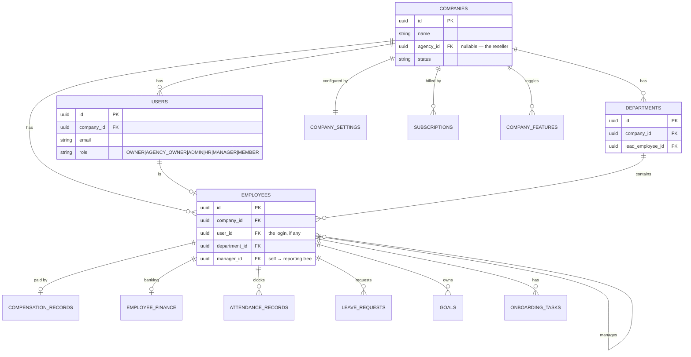
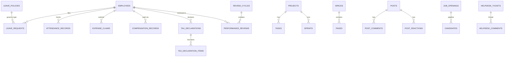
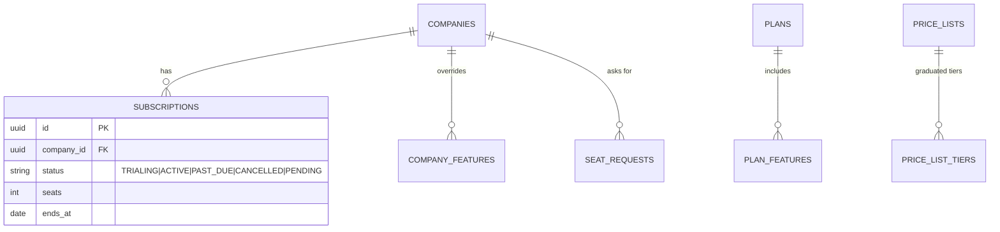

# Database guide — tables, relationships & diagram

A tour of Calyvora's database: how multi-tenancy works, the core tables everything hangs off, and a
map of all 57 tables grouped by module. The diagrams are [Mermaid](https://mermaid.js.org/) — GitHub
renders them automatically; in an editor, use a Mermaid preview.

The schema is owned by **Flyway** migrations in `backend/src/main/resources/db/migration` (V1–V58).
Entities live under `backend/src/main/java/com/calyvora/**`.

---

## 1. The one idea that explains the whole schema: tenancy

Almost every table carries a **`company_id`** column. That's the tenant key — it says which customer
a row belongs to. `companies` is referenced by **53** of the 57 tables; `users` by 33; `employees` by
18. So the shape is a hub-and-spoke: **`companies` at the center, everything else hanging off it.**

Two roles sit *above* a company (the vendor platform and agencies); everything else is *inside* one
company. Customers never see each other's rows because **Postgres Row-Level Security** filters every
query by the current tenant (`FORCE ROW LEVEL SECURITY` on every tenant table — see
[DEPLOY.md](DEPLOY.md) and NEON-DB-SETUP.md). The app sets the tenant per request; the database
enforces it even if application code has a bug.



**The reporting tree** is `employees.manager_id` pointing at another employee. That tree — not the
job title — is what grants visibility (PD-32): you can see the people below you in it.

---

## 2. Identity & access

| Table | What it holds |
|---|---|
| `companies` | One row per tenant (customer). `agency_id` links to a reseller company, if any. |
| `users` | Login accounts. `role` is the access level. Belongs to a company. |
| `employees` | The person record — profile, department, `manager_id` (reporting tree). Linked to a `user` when they can log in. |
| `company_settings` | Per-company config: currency, timezone, idle timeout, etc. |
| `departments` | Teams; each may have a lead employee. |
| `designations` | The company's job-title ladder. |
| `invitations` | Pending "join the company" invites (consumed on accept). |
| `refresh_tokens` | Rotating session tokens (theft detection). |
| `email_verification_tokens`, `password_reset_codes` | One-time auth tokens. |

---

## 3. Tables by module (all 57)

Every table below also has a **`company_id`** (the tenant key) unless it's a platform-level table.

**People & org** — `employees`, `departments`, `designations`, `onboarding_tasks`, `goals`,
`holidays`, `employee_finance`
**Attendance & leave** — `attendance_records`, `attendance_regularizations`, `leave_requests`,
`leave_policies`, `comp_off_credits`, `shifts`, `shift_assignments`
**Payroll & money** — `compensation_records`, `payslip_components`, `pf_settings`, `expense_claims`,
`tax_declarations`, `tax_declaration_items`
**Documents** — `document_templates`, `generated_documents`, `letterheads`
**Recruitment** — `job_openings`, `candidates`
**Performance** — `review_cycles`, `performance_reviews`
**Work (projects)** — `projects`, `tasks`, `sprints`, `sprint_snapshots`, `tickets`
**Knowledge** — `spaces`, `pages`
**Helpdesk** — `helpdesk_tickets`, `helpdesk_comments`
**Feed** — `posts`, `post_comments`, `post_reactions`
**Clients (agency staffing)** — `clients`, `client_requests`
**Notifications** — `notifications`
**Billing & plans** — `subscriptions`, `plans`, `plan_features`, `company_features`, `price_lists`,
`price_list_tiers`, `seat_requests`
**Platform intake** — `trial_requests`
**Identity/auth** — `companies`, `users`, `company_settings`, `invitations`, `refresh_tokens`,
`email_verification_tokens`, `password_reset_codes`

---

## 4. How a few modules connect



---

## 5. Billing shape


- A **plan** is a bundle of features; `company_features` lets the vendor toggle a single module for one
  company on top of its plan.
- **Price lists** are per-currency with graduated **tiers** (cheaper rate above a headcount threshold).
- A **subscription** ties a company to seats + status; `ends_at` in the past locks the tenant.

---

## 6. Reading it in the code

- **Schema (source of truth):** the Flyway SQL in `db/migration` — each `Vnn__*.sql` is one change.
- **Entities:** `@Entity` classes per module package (e.g. `people/Employee.java`, `billing/Subscription.java`).
- **Access rules:** `V12__rls_tenant_isolation.sql` plus the per-table `FORCE ROW LEVEL SECURITY`
  statements define who can read what at the database level; `OrgScope` defines the reporting-tree
  visibility in code.

To see the live columns of any table, run in the Neon SQL editor:
```sql
\d+ employees        -- structure of one table
\dt                  -- list all tables
```
