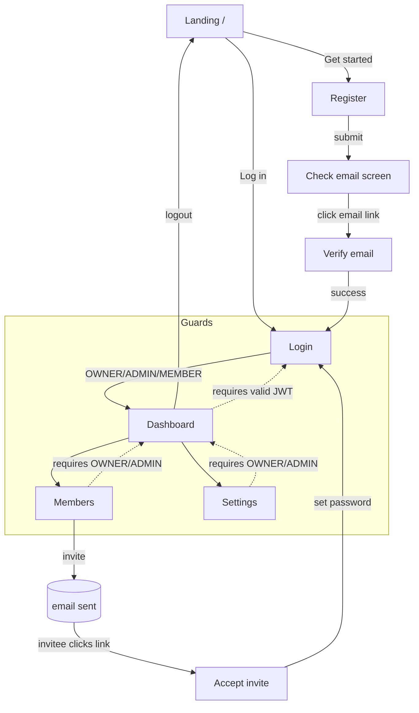

# Sprint 1 — Platform Foundation (Implementation Plan)

> **Status:** PLAN — awaiting founder approval. No application code is written until this plan is
> approved. · **Date:** 2026-07-05 · **Owner:** Founding engineering.
>
> This sprint builds the **platform every future module depends on** — tenancy, identity,
> authentication, RBAC, the invitation lifecycle, and the app shell. It is *not* HRMS and *not*
> Scrum. It is the spine. Binding architecture lives in [/docs](README.md); this is the concrete
> Sprint-1 execution of it.

---

## 0. Key Sprint-1 decisions (please veto any you disagree with)

These ripple through everything below. I've made the pragmatic MVP call and stated the trade-off.

| # | Decision | Recommended | Why / trade-off |
|---|----------|-------------|-----------------|
| D1 | **Persistence** | **Spring Data JPA (Hibernate)** | Faster for related entities than JDBC; less boilerplate. Trade-off: less explicit SQL. We keep entities anemic + logic in services to avoid Hibernate footguns. |
| D2 | **Tenancy enforcement** | **`company_id` column on every tenant-owned table + mandatory `TenantContext` filter in the service/repository layer.** Postgres **RLS deferred to Sprint 2.** | Full RLS is the real backstop but adds setup cost. For one sprint we accept app-layer enforcement **plus adversarial cross-tenant tests** as the gate. Documented as tech debt with a Sprint-2 payoff. |
| D3 | **User ↔ Company** | **Email is globally unique; a user belongs to exactly one company** (role stored on user). | Simplest correct MVP. Trade-off: a person can't be in two companies yet. Migration path to a `memberships` join table is documented (Future Enhancements). |
| D4 | **Registration flow** | On register we **create the Company + Owner user immediately in `PENDING_VERIFICATION`**; email verification **activates** them. | Avoids a separate `registrations` table. Their "Feature 4 (Org Creation)" and "Feature 5 (Admin Creation)" are the *logic executed inside* register/verify, not separate screens. Trade-off: unverified tenants exist → a cleanup job is future work. |
| D5 | **Tokens** | **Access JWT ~15 min (in-memory on client)** + **rotating refresh token in httpOnly, Secure, SameSite cookie**, refresh tokens **hashed at rest** for revocation. HS256 for MVP. | Balances security and simplicity. Trade-off: HS256 (shared secret) → move to RS256 in Sprint 2. |
| D6 | **Email (local dev)** | **Mailpit** SMTP catcher in Docker Compose; `EmailService` interface so prod swaps to SES/Resend later. | Zero external dependency to demo verification + invites locally. |
| D7 | **Repo & build** | **Monorepo**: `/backend` (Gradle, Kotlin DSL), `/frontend` (Next.js), `/infra`, `/docs`. | Atomic cross-cutting changes; matches the constitution's monorepo stance. |
| D8 | **Roles (Sprint 1 only)** | `OWNER`, `ADMIN`, `MEMBER` | Smallest set that demonstrates RBAC. The full RBAC+ABAC engine ([docs/08](08-security-architecture.md)) is later. |

---

## 1. Sprint Goal

> **Deliver a secure, multi-tenant platform foundation: a visitor can register a company, verify
> their email, and land in a protected dashboard as its Owner; that Owner can invite employees who
> accept, set a password, and log in; and access to every screen and API is governed by JWT +
> role-based authorization — all runnable locally via `docker compose up`.**

Success = the 13 demo capabilities work end-to-end, tenant isolation holds under test, and the
code is production-shaped (tests, validation, error handling, docs) — not a throwaway prototype.

## 2. Sprint Backlog

| ID | Item | Layer | Priority |
|----|------|-------|----------|
| S1-1 | Project scaffolding: monorepo, Docker Compose (Postgres + Mailpit), Spring Boot app, Next.js app, CI | Infra | Critical |
| S1-2 | Foundation: `TenantContext`, error model, security config, Flyway baseline | Backend | Critical |
| S1-3 | Landing page | Frontend | High |
| S1-4 | Company registration (+ Company + Owner creation) | Full-stack | Critical |
| S1-5 | Email verification + activation | Full-stack | Critical |
| S1-6 | Authentication (login, refresh, logout, `/me`) + JWT | Full-stack | Critical |
| S1-7 | Role-based authorization (method + route guards) | Full-stack | Critical |
| S1-8 | Dashboard (protected shell + summary) | Full-stack | High |
| S1-9 | Invite employee (create/list/revoke invitation, send email) | Full-stack | High |
| S1-10 | Employee activation (accept invite, set password, login) | Full-stack | High |
| S1-11 | Company settings (view/update) | Full-stack | Medium |
| S1-12 | Docs: README, CHANGELOG, DECISIONS, Architecture, API, Database | Docs | High |

## 3. User Stories

- **US-1 (Visitor):** As a visitor, I can learn what Calyvora is on a landing page and click
  "Get started" so that I can register my company.
- **US-2 (Founder/Owner):** As a company founder, I can register with my company name, name, email,
  and password so that a company workspace and my Owner account are created.
- **US-3 (Owner):** As a new registrant, I receive a verification email and can verify my address so
  that my account is activated and I can log in.
- **US-4 (Owner):** As a verified Owner, I can log in and stay logged in across refreshes so that I
  can use the platform securely.
- **US-5 (Owner):** As an Owner, I land on a dashboard showing my company at a glance.
- **US-6 (Admin/Owner):** As an Owner/Admin, I can invite an employee by email with a role so that
  they can join my company.
- **US-7 (Employee):** As an invited employee, I can accept the invitation, set my name and password,
  and log in so that I can access the company workspace.
- **US-8 (Owner/Admin):** As an Owner/Admin, I can view and update company settings so that the
  workspace reflects my company.
- **US-9 (Member):** As a Member, I am blocked from admin-only screens/actions so that authorization
  is enforced.
- **US-10 (Any tenant):** As a user of company A, I can never see or affect company B's data.

## 4. Acceptance Criteria (per story, condensed to the testable essentials)

**US-2 Registration**
- Given valid inputs, a `company` (status `PENDING`) and an `OWNER` user (status
  `PENDING_VERIFICATION`) are created atomically; password is BCrypt-hashed; a verification email
  is sent.
- Duplicate email → `409 CONFLICT`, no records created.
- Invalid input (weak password, bad email, missing fields) → `400` with field errors; nothing created.

**US-3 Email verification**
- Valid, unexpired, unconsumed token → user `ACTIVE`, company `ACTIVE`, token consumed, cannot be
  reused.
- Expired/invalid/consumed token → `400/410` with a clear message; a "resend" path exists.

**US-4 Login / JWT**
- Correct credentials on an `ACTIVE` user → `200` with access JWT (claims: `sub`, `companyId`,
  `role`, `exp`) + rotating refresh cookie.
- Wrong password / unknown email → `401` (identical generic message, no user enumeration).
- `PENDING_VERIFICATION` user → `403` "verify your email".
- `/auth/refresh` with a valid cookie issues a new access token and rotates the refresh token;
  reuse of a rotated refresh token revokes the token family.

**US-6/US-7 Invitations**
- Owner/Admin can create an invitation (`email`, `role`); Member cannot (`403`).
- Invitee receives an email; accepting with a valid token + password creates an `ACTIVE` `MEMBER`
  (or invited role) user in that company and consumes the invitation.
- Re-inviting an existing member → `409`; expired invite → `410`.

**US-8 Settings**
- Owner/Admin can `GET`/`PATCH` company settings; changes persist and are tenant-scoped.
- Member `PATCH` → `403`.

**US-9/US-10 AuthZ & isolation**
- Every protected endpoint rejects unauthenticated requests (`401`) and unauthorized roles (`403`).
- Automated test: authenticate as company A, attempt to read/modify company B resources → all denied.

## 5. Database Schema

Postgres. All timestamps `timestamptz`. IDs `uuid` (app-generated, `gen_random_uuid()` fallback).
Tenant-owned tables carry `company_id`.

```sql
-- V1__baseline.sql (Flyway)
create table companies (
  id            uuid primary key,
  name          varchar(120) not null,
  slug          varchar(140) not null unique,
  status        varchar(24)  not null default 'PENDING', -- PENDING|ACTIVE|SUSPENDED
  created_at    timestamptz  not null default now(),
  updated_at    timestamptz  not null default now()
);

create table users (
  id                 uuid primary key,
  company_id         uuid not null references companies(id),
  email              varchar(255) not null unique,      -- globally unique (D3)
  password_hash      varchar(100),                      -- null until set (invited users)
  first_name         varchar(80)  not null,
  last_name          varchar(80)  not null,
  role               varchar(24)  not null,             -- OWNER|ADMIN|MEMBER
  status             varchar(24)  not null,             -- PENDING_VERIFICATION|INVITED|ACTIVE|DISABLED
  email_verified_at  timestamptz,
  created_at         timestamptz  not null default now(),
  updated_at         timestamptz  not null default now()
);
create index idx_users_company on users(company_id);

create table email_verification_tokens (
  id           uuid primary key,
  user_id      uuid not null references users(id),
  token_hash   varchar(64) not null,   -- sha-256 of the raw token
  expires_at   timestamptz not null,
  consumed_at  timestamptz,
  created_at   timestamptz not null default now()
);
create index idx_evt_user on email_verification_tokens(user_id);

create table invitations (
  id                 uuid primary key,
  company_id         uuid not null references companies(id),
  email              varchar(255) not null,
  role               varchar(24)  not null,             -- ADMIN|MEMBER
  token_hash         varchar(64)  not null,
  status             varchar(24)  not null default 'PENDING', -- PENDING|ACCEPTED|REVOKED|EXPIRED
  invited_by         uuid not null references users(id),
  expires_at         timestamptz  not null,
  accepted_at        timestamptz,
  created_at         timestamptz  not null default now()
);
create unique index uq_invite_active on invitations(company_id, lower(email))
  where status = 'PENDING';

create table refresh_tokens (
  id           uuid primary key,
  user_id      uuid not null references users(id),
  token_hash   varchar(64) not null,
  family_id    uuid not null,          -- for rotation/reuse-detection
  expires_at   timestamptz not null,
  revoked_at   timestamptz,
  user_agent   varchar(255),
  created_at   timestamptz not null default now()
);
create index idx_rt_user on refresh_tokens(user_id);

create table company_settings (
  company_id   uuid primary key references companies(id),
  timezone     varchar(64)  not null default 'UTC',
  locale       varchar(16)  not null default 'en',
  logo_url     varchar(500),
  updated_at   timestamptz  not null default now()
);
```

> **Isolation note (D2):** for Sprint 1, `company_id` filtering is enforced in the repository/service
> layer via `TenantContext`. Sprint 2 adds Postgres RLS policies keyed on a session GUC as the
> backstop. Raw tokens are never stored — only SHA-256 hashes; the raw token lives only in the email link.

## 6. Folder Structure

```
calyvora/
├─ backend/                         # Spring Boot 3, Java 21, Gradle (Kotlin DSL)
│  ├─ build.gradle.kts
│  └─ src/main/java/com/calyvora/
│     ├─ CalyvoraApplication.java
│     ├─ common/
│     │  ├─ config/        (SecurityConfig, OpenApiConfig, JacksonConfig, CorsConfig)
│     │  ├─ security/      (JwtService, JwtAuthFilter, TenantContext, TenantFilter, CurrentUser)
│     │  ├─ error/         (ApiError, GlobalExceptionHandler, domain exceptions)
│     │  └─ util/          (TokenGenerator, Slugs, Clock)
│     ├─ auth/             (AuthController, AuthService, dto/, RefreshTokenService, RefreshTokenRepository)
│     ├─ identity/         (User, UserRepository, UserService, Role, UserStatus)
│     ├─ company/          (Company, CompanyRepository, CompanyService, CompanySettings…, dto/)
│     ├─ invitation/       (Invitation, InvitationController/Service/Repository, dto/)
│     ├─ email/            (EmailService iface, MailpitEmailService, templates/)
│     └─ dashboard/        (DashboardController, DashboardService, dto/)
│  ├─ src/main/resources/
│  │  ├─ application.yml, application-local.yml
│  │  └─ db/migration/V1__baseline.sql
│  └─ src/test/java/com/calyvora/   (unit + integration w/ Testcontainers)
│
├─ frontend/                        # Next.js (App Router), TS, Tailwind, shadcn/ui
│  └─ src/
│     ├─ app/
│     │  ├─ (marketing)/page.tsx                # Landing "/"
│     │  ├─ (auth)/{register,verify-email,login,accept-invite}/page.tsx
│     │  ├─ (app)/dashboard/page.tsx
│     │  ├─ (app)/settings/page.tsx
│     │  ├─ (app)/members/page.tsx              # list + invite
│     │  ├─ layout.tsx  middleware.ts
│     ├─ components/{ui/*, forms/*, layout/*}
│     ├─ lib/{api.ts, auth.ts, validators.ts}   # fetch client, zod schemas
│     └─ hooks/{useAuth.ts, useSession.ts}
│
├─ infra/  docker-compose.yml  (postgres, mailpit, backend, frontend)
├─ docs/   (constitution 00–15, Sprint1.md, Architecture.md, API.md, Database.md)
├─ .github/workflows/ci.yml
├─ README.md  CHANGELOG.md  DECISIONS.md  FOUNDER.md
```

Backend is organized **by feature (bounded context), not by layer** — per
[docs/14 §14.2](14-engineering-standards.md). Each feature package is a future extraction candidate.

## 7. API Design

Base path `/api/v1`. JSON. Standard error envelope (§13). Cursor/no pagination needed this sprint.

| Method | Path | Auth | Role | Purpose |
|--------|------|------|------|---------|
| POST | `/auth/register` | public | — | Create company + Owner (PENDING); send verification email |
| POST | `/auth/verify-email` | public | — | Body `{token}`; activate user + company |
| POST | `/auth/resend-verification` | public | — | Body `{email}`; re-send (rate-limited) |
| POST | `/auth/login` | public | — | Body `{email,password}` → access JWT + refresh cookie |
| POST | `/auth/refresh` | cookie | — | Rotate refresh, issue new access token |
| POST | `/auth/logout` | cookie | — | Revoke refresh token family |
| GET | `/auth/me` | JWT | any | Current user + company |
| GET | `/company` | JWT | any | Current company profile |
| PATCH | `/company/settings` | JWT | OWNER, ADMIN | Update settings |
| GET | `/company/members` | JWT | OWNER, ADMIN | List members |
| POST | `/invitations` | JWT | OWNER, ADMIN | Body `{email, role}`; create + email invite |
| GET | `/invitations` | JWT | OWNER, ADMIN | List pending invitations |
| DELETE | `/invitations/{id}` | JWT | OWNER, ADMIN | Revoke invitation |
| POST | `/invitations/accept` | public | — | Body `{token, firstName, lastName, password}` |
| GET | `/dashboard/summary` | JWT | any | Counts (members, pending invites, etc.) |

All endpoints documented via **springdoc-openapi** (Swagger UI at `/swagger-ui.html`); `API.md` is
generated/curated from the OpenAPI spec.

## 8. UI Screens

| Screen | Route | Access | Key elements |
|--------|-------|--------|--------------|
| Landing | `/` | public | Hero, value prop, "Get started" → register, "Log in" |
| Register | `/register` | public | Form (company, first/last name, email, password + strength); success → "check your email" |
| Verify email | `/verify-email?token=` | public | Auto-verifies on load; success/failure states; resend |
| Login | `/login` | public | Email/password; error states; link to register |
| Accept invite | `/accept-invite?token=` | public | Shows company + email (read-only); set name + password |
| Dashboard | `/dashboard` | authed | App shell (top bar, nav), welcome, summary cards |
| Members | `/members` | OWNER/ADMIN | Member table, pending invites, "Invite" dialog |
| Settings | `/settings` | OWNER/ADMIN | Company name (read), timezone, locale, logo URL |

All screens: responsive (mobile-first), loading skeletons, empty/error states, shadcn/ui components,
accessible forms (labels, aria, keyboard). Member sees Dashboard but not Members/Settings nav.

## 9. Navigation Flow



## 10. Security Design

- **AuthN:** Spring Security as a stateless JWT resource server. Passwords BCrypt (strength 10+).
  Access token HS256, ~15 min, claims `sub`, `companyId`, `role`, `jti`, `exp`. Refresh token:
  opaque random (256-bit), **hashed at rest**, in httpOnly+Secure+SameSite=Lax cookie, rotating with
  **reuse detection** (reused token → revoke whole `family_id`).
- **AuthZ:** `@PreAuthorize("hasAnyRole('OWNER','ADMIN')")` on protected methods; roles mapped to
  `ROLE_*` authorities from the JWT. Frontend route guards in `middleware.ts` + conditional nav
  (defense in depth — server is the source of truth).
- **Tenant isolation (D2):** `TenantFilter` sets `TenantContext` (companyId) from the JWT after auth;
  every tenant-scoped query filters on it; services reject any resource whose `company_id` ≠ context.
  Adversarial cross-tenant tests are a merge gate.
- **Hardening:** generic auth errors (no user enumeration), rate-limiting on register/login/resend
  (bucket per IP+email), CORS locked to the frontend origin, security headers, input validation
  everywhere, tokens single-use + expiring, secrets via env (Docker secrets), no secrets in code.
- **Out of scope this sprint (documented):** RLS, RS256, SSO/OIDC, MFA, full RBAC+ABAC engine,
  audit service — all scheduled per [docs/08](08-security-architecture.md).

## 11. Sequence Diagrams

**Registration → verification → activation**
```mermaid
sequenceDiagram
  participant U as Visitor
  participant FE as Next.js
  participant API as Spring Boot
  participant DB as Postgres
  participant MP as Mailpit
  U->>FE: Submit register form
  FE->>API: POST /auth/register
  API->>DB: tx { insert company(PENDING), user(OWNER,PENDING), token }
  API->>MP: send verification email (raw token in link)
  API-->>FE: 201 Created
  U->>FE: Click link /verify-email?token
  FE->>API: POST /auth/verify-email {token}
  API->>DB: validate hash+expiry; user ACTIVE, company ACTIVE, consume token
  API-->>FE: 200 OK → redirect /login
```

**Login + refresh rotation**
```mermaid
sequenceDiagram
  participant FE as Next.js
  participant API as Spring Boot
  FE->>API: POST /auth/login {email,password}
  API->>API: verify BCrypt, check ACTIVE
  API-->>FE: 200 {accessToken} + Set-Cookie refresh (rotating)
  Note over FE: access token in memory
  FE->>API: GET /dashboard/summary (Bearer access)
  API-->>FE: 200 summary
  FE->>API: POST /auth/refresh (cookie) when access expires
  API->>API: validate+rotate; reuse ⇒ revoke family
  API-->>FE: 200 {new accessToken} + new cookie
```

**Invite → accept**
```mermaid
sequenceDiagram
  participant A as Owner/Admin
  participant API as Spring Boot
  participant MP as Mailpit
  participant E as Invitee
  A->>API: POST /invitations {email,role} (Bearer)
  API->>API: authorize OWNER/ADMIN; create invitation(PENDING)+token
  API->>MP: send invite email
  E->>API: POST /invitations/accept {token,name,password}
  API->>API: validate token; create user(ACTIVE, role) in company; consume invite
  API-->>E: 200 → /login
```

## 12. Validation Rules

| Field | Rule |
|-------|------|
| Company name | required, 2–120 chars |
| Email | required, RFC-valid, ≤255, normalized lower-case, globally unique |
| Password | required, ≥10 chars, ≥1 letter + ≥1 number (zxcvbn-style strength shown client-side) |
| First/last name | required, 1–80 chars, trimmed |
| Role (invite) | required, one of `ADMIN`, `MEMBER` (cannot invite `OWNER`) |
| Token (verify/accept) | required, valid hash, unexpired, unconsumed |
| Settings.timezone | valid IANA zone; locale from allow-list; logo_url valid https URL, ≤500 |

Validation is **layered**: zod on the client (UX) **and** Bean Validation (`jakarta.validation`) on
the server (authority). Server never trusts the client.

## 13. Error Handling Strategy

- **One envelope** via `@RestControllerAdvice`:
  ```json
  { "timestamp":"…","status":400,"code":"VALIDATION_ERROR",
    "message":"Human message","correlationId":"uuid",
    "errors":[{"field":"email","message":"already in use"}] }
  ```
- **Typed domain exceptions** → HTTP mapping: `NotFound`→404, `Conflict`→409, `Forbidden`→403,
  `Unauthorized`→401, `TokenExpired`→410, `Validation`→400, uncaught→500 (no stack trace leaked).
- **Fail safe:** on any auth/tenant doubt, deny. Never log secrets/passwords/raw tokens.
- **Correlation id** on every request (filter) → returned in errors + logs for support.
- **Frontend:** central API client maps error codes → toast + inline field errors; distinct
  loading / empty / error UI states on every data view.

## 14. Testing Strategy

| Level | Tooling | Coverage focus |
|-------|---------|----------------|
| Unit | JUnit 5 + Mockito + AssertJ | Services: registration, token hash/expiry, refresh rotation/reuse, invite lifecycle, password policy |
| Integration | Spring Boot Test + **Testcontainers (Postgres)** + MockMvc | Each endpoint: happy + failure paths; Flyway migration applies |
| **Security/isolation** | Integration | **Cross-tenant access denied**, role gates (Member→403), unauth→401, no user enumeration, refresh reuse revokes family |
| Contract | springdoc snapshot | OpenAPI doesn't break silently |
| Frontend | Vitest + Testing Library (components), 1 Playwright happy-path E2E (register→verify→login→invite→accept→login) | Forms, guards, the golden demo path |

Merge gate: all tests green + isolation tests present. Coverage is a signal, not a target; the
security/isolation and auth paths get the highest rigor ([docs/14 §14.7](14-engineering-standards.md)).

## 15. Development Order (vertical slices, each production-ready before the next)

The founder's feature list, sequenced so each step is demoable and de-risks the next:

0. **S1-1/S1-2 Scaffolding + Foundation** — compose stack, Spring Boot, Next.js, security skeleton,
   Flyway baseline, error model, `TenantContext`, CI, Swagger, health check. *(Enables everything.)*
1. **Feature 1 — Landing page** (fast win, no backend).
2. **Feature 2+4+5 — Registration** (creates Company + Owner). *Backend-first, then form.*
3. **Feature 3 — Email verification + activation.**
4. **Feature 6 — Authentication** (login/refresh/logout/`/me` + JWT). *Now the app is enterable.*
5. **Feature 7 — Dashboard** (protected shell + `/dashboard/summary`) **+ RBAC guards**.
6. **Feature 8 — Invite employee.**
7. **Feature 9 — Employee activation** (accept invite → login).
8. **Feature 10 — Company settings.**
9. **Docs pass + demo script + polish** (responsive, empty/error states, CHANGELOG).

> I will not jump ahead. Each feature ships backend + migration + DTO + validation + service + repo +
> unit/integration tests + REST + Swagger + frontend + error/loading/responsive + docs before I start
> the next, per your Implementation Rules.

## 16. Risks

| Risk | Likelihood | Impact | Mitigation |
|------|-----------|--------|-----------|
| **Scope > one week** for production quality | High | Med | Vertical slices; demoable after Feature 6; cut Settings/Members polish first if time-boxed |
| **Tenant isolation bug** (D2 app-layer only) | Med | **High** | Mandatory `TenantContext`, adversarial cross-tenant tests as merge gate, RLS fast-follow Sprint 2 |
| Refresh-token rotation edge cases | Med | Med | Reuse-detection tests; short access TTL limits exposure |
| Email deliverability confusion in demo | Low | Med | Mailpit UI in compose; clear "check email" screen; resend path |
| JWT/CORS/cookie misconfig blocking FE↔BE | Med | Med | Nail auth+CORS in S1-2 foundation before feature work; one E2E covers it |
| Over-engineering the foundation | Med | Med | Only build what these 10 features need; RBAC engine/SSO explicitly deferred |
| Hibernate misuse (N+1, lazy issues) | Med | Low | Simple aggregates, explicit fetch, integration tests on queries |

## 17. Time Estimate (one focused engineer; ranges, not promises)

| Block | Estimate |
|-------|----------|
| S1-1/S1-2 Scaffolding + Foundation | 1.5–2.5 days |
| F1 Landing | 0.5 day |
| F2 Registration (+company/owner) | 1–1.5 days |
| F3 Verification | 0.5–1 day |
| F6 Auth + JWT + refresh | 1.5–2 days |
| F7 Dashboard + RBAC | 1 day |
| F8 Invite | 1 day |
| F9 Accept invite | 0.5–1 day |
| F10 Settings | 0.5–1 day |
| Docs + polish + E2E | 1–1.5 days |
| **Total** | **~9–14 working days** |

Honest read: this is a **2–3 week** foundation, not a 5-day sprint — and it's the right thing to
invest in because every future module rides on it. A **"minimum demoable" milestone at Feature 6**
(register → verify → login → protected dashboard) is reachable in the first week.

## 18. Future Enhancements (explicitly deferred — logged so we don't gold-plate now)

- **Sprint 2:** Postgres **RLS** backstop; **RS256** JWT + key rotation; audit-log service; rate-limit
  hardening; account lockout; password reset; "resend/expire cleanup" jobs.
- **Identity evolution:** `memberships` join table so a user can belong to **multiple companies**
  (supersedes D3); SSO/OIDC (Entra/Google/Okta) + SCIM per [docs/08](08-security-architecture.md).
- **RBAC → RBAC+ABAC engine** with custom roles/permissions and scopes.
- **Email:** production provider (SES/Resend), templated/branded emails, deliverability.
- **Company:** slug/subdomain routing, logo upload (object storage) vs URL, richer settings.
- **Observability:** OpenTelemetry traces/metrics, structured tenant-tagged logs.
- **Frontend:** design-system tokens, dark mode, i18n, richer member management.

---

### Definition of Done (per feature)
Backend (migration, DTOs, Bean Validation, service, repository) · unit + integration tests (incl.
authz/tenant where relevant) · REST endpoint + Swagger · frontend page/components/form + API
integration · error + loading + empty states · responsive · docs updated (API.md/Database.md/
CHANGELOG) · all tests green in CI. Only then does the next feature start.
